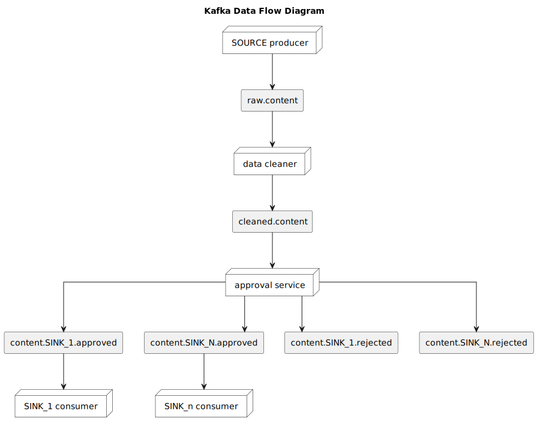

<p align="center">
  
</p>

<h1 align="center">ContentFlow Manager</h1>

<p align="center">
  Платформа для командного управления контентом: фильтрация, модерация и автопостинг в Telegram и другие соцсети.
</p>

[]()
[]()

> B2B-платформа для управления потоками контента в соцсетях. Настраивайте фильтры, автоматизируйте постинг, подключайте Telegram-клиентов и управляйте редакторскими процессами в командах.

---

## Архитектура

---

## Структура проекта

`./CRM` — BFF

`./TelegramClient` — микросервис для парсинга и постинга сообщений из телеграма

`./Filter` — микросервис для фильтрации и изменения постов

`./ApprovalService` — микросервис для подтверждения постов

## Технологии

- **Java 21**, **Spring Boot 3.4**
- **Spring Security**, **JWT**
- **gRPC**, **Kafka**, **Protobuf**
- **MongoDB**, **PostgreSQL**
- **TDLight Telegram API**
- **Docker**, **Docker Compose**

## Запуск проекта
```bash
git clone https://github.com/arklual/drip-java-project-2025
cd drip-java-project-2025
docker-compose up --build
```
Swagger UI доступен на http://localhost/swagger-ui/index.html
> **Важно!** Для работы нужно вставить свой `GIGACHAT_AUTH_KEY` в `docker-compose.yml`. Получить можно здесь: https://developers.sber.ru/studio/workspaces/my-space/get/gigachat-api
## Тестирование
```bash~~~~
cd нужный_вам_микросеравис
./mvnw clean verify
```
Coverage можно посмотреть в `target/site/jacoco/index.html`
## Документация
- [REST API спецификация](openapi.yaml)

## Хранение данных
### PostgreSQL в микросервисе CRM - хранение пользователей и команд
```
┌────────────────────────────────────────────────────────────────────────┐                                                                            
│users                                                                   │  ┌────────────────────────────────────────────────────────────────────────┐
├────────────────────────────────────────────────────────────────────────┤  │teams                                                                   │
│id <b>(PK)</b> : UUID                                                   │  ├────────────────────────────────────────────────────────────────────────┤
│created_at  : TIMESTAMP <<NOT NULL>>                                    │  │id <b>(PK)</b> : UUID                                                   │
│updated_at  : TIMESTAMP <<NOT NULL>>                                    │  │created_at  : TIMESTAMP <<NOT NULL>>                                    │
│email       : VARCHAR  <<NOT NULL>> {unique}                            │  │updated_at  : TIMESTAMP <<NOT NULL>>                                    │
│password_hash : VARCHAR <<NOT NULL>>                                    │  │name        : VARCHAR  <<NOT NULL>>                                     │
│name        : VARCHAR  <<NOT NULL>>                                     │  │status      : VARCHAR  <<NOT NULL>>             | enum ACTIVE | INACTIVE│
│status      : VARCHAR  <<NOT NULL>>             | enum ACTIVE | INACTIVE│  └────────────────────────────────────────────────────────────────────────┘
└────────────────────────────────────────────────────────────────────────┘                                                                            
                                                                                                                                                      
                                                                                                                                                      
                                   ┌──────────────────────────────────────────────────────────────────────────────┐                                   
                                   │team_members                                                                  │                                   
                                   ├──────────────────────────────────────────────────────────────────────────────┤                                   
                                   │id <b>(PK)</b> : UUID                                                         │                                   
                                   │created_at  : TIMESTAMP <<NOT NULL>>                                          │                                   
                                   │updated_at  : TIMESTAMP <<NOT NULL>>                                          │                                   
                                   │team_id <u>(FK)</u>  : UUID <<NOT NULL>>                                      │                                   
                                   │user_id <u>(FK)</u>  : UUID <<NOT NULL>>                                      │                                   
                                   │role        : VARCHAR <<NOT NULL>>              | enum ADMIN | EDITOR | VIEWER│                                   
                                   └──────────────────────────────────────────────────────────────────────────────┘                                   
```
### MongoDB - в каждом Source микросервисе - хранение Flow
#### MongoDB в Telegram Client:

#### Пример:
```json
{
  "_id": "665f8a927acb080001e1f5a0",
  "teamId": "d9f52e5c-3cfa-4b42-821a-8c93f14f21dd",
  "source": {
    "type": "telegram_source",
    "chatId": "-1001234567890"
  },
  "sinks": [
    {
      "type": "telegram_sink",
      "chatId": "-1009876543210"
    }
  ],
  "filters": [
    {
      "type": "text_replace",
      "trigger": "#promo",
      "pattern": "free",
      "replacement": "бесплатно"
    },
    {
      "type": "remove_photo",
      "trigger": "#private"
    },
    {
      "type": "add_photo",
      "trigger": "#cover",
      "photoUrl": "https://example.com/photo.jpg"
    },
    {
      "type": "ai_filter",
      "trigger": "#summarize",
      "prompt": "Summarize the post:"
    }
  ],
  "requiresModeration": true,
  "updatedAt": "2025-06-09T08:52:31.456Z"
}
```
## Передача сообщение через Kafka

### Структура `Post`
| Поле                  | Тип                  | Описание                                          |
|------------------------|-----------------------|---------------------------------------------------|
| `id`                   | `string`             | Уникальный идентификатор поста                    |
| `team_id`              | `string`             | Идентификатор команды                             |
| `source`               | `Source` (oneof)     | Источник (например, Telegram)                     |
| `content`              | `string`             | Основной текст поста                              |
| `media`                | `Media[]`            | Вложения (фото, видео, аудио)                     |
| `created_at`           | `int64`              | Время создания (timestamp в ms)                   |
| `updated_at`           | `int64`              | Время обновления (timestamp в ms)                 |
| `status`               | `PostStatus`         | Статус обработки поста                            |
| `requires_moderation` | `bool`               | Требуется ли модерация                            |
| `is_cleaned`           | `bool`               | Прошёл ли он через сервис Filter                  |
| `sink`                 | `Sink[]` (oneof)     | Куда пост будет отправлен                         |
| `filter`               | `Filter[]` (oneof)   | Какие фильтры должны быть применены к содержимому |

### Enum: `PostStatus`

```protobuf
enum PostStatus {
  DRAFT = 0;
  PENDING_REVIEW = 1;
  APPROVED = 2;
  REJECTED = 3;
  READY_TO_POST = 4;
  POSTED = 5;
  FAILED = 6;
}
```
### `Source`
```protobuf
message TelegramSource {
  string chatId = 1;
}

message Source {
  oneof source_type {
    TelegramSource telegram_source = 1;
  }
}
```
### `Filter`
```protobuf
message AddPhotoFilter {
  string trigger = 1;
  string photo_url = 2;
}

message RemovePhotoFilter {
  string trigger = 1;
}

message TextReplaceFilter {
  string trigger = 1;
  string pattern = 2;
  string replacement = 3;
}

message AIFilter {
  string trigger = 1;
  string prompt = 2;
}

message Filter {
  oneof filter_type {
    AddPhotoFilter add_photo = 1;
    RemovePhotoFilter remove_photo = 2;
    TextReplaceFilter text_replace = 3;
    AIFilter ai_filter = 4;
  }
}
```
### `Sink`
```protobuf
message TelegramSink {
  string chatId = 1;
}

message Sink {
  oneof sink_type {
    TelegramSink telegram_sink = 1;
  }
}
```
